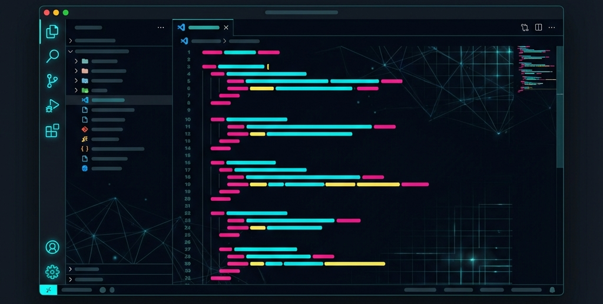

# 💻 Visual Studio Code Style Portfolio



[](https://garvitdani-portfolio.vercel.app/)
[](https://reactjs.org/)
[](https://tailwindcss.com/)
[](https://vitejs.dev/)

A premium, highly interactive developer portfolio that replicates the **Visual Studio Code** environment. This project is designed to showcase my skills, experience, and projects in a way that feels natural to fellow developers.

---

## ✨ Features

- **📂 Functional Explorer**: Navigate through different sections (`Skills`, `Projects`, `Experience`) just like a project directory.
- **📑 Multi-Tab Interface**: Open multiple "files" and switch between them seamlessly.
- **🤖 Integrated AI Chatbot**: A custom sidebar assistant to help visitors learn more about my work.
- **🔥 GitHub Streak Graph**: Real-time visualization of my coding activity and contributions.
- **🎨 Dynamic Themes**: Pixel-perfect VS Code aesthetic with smooth transitions and glassmorphism.
- **📱 Fully Responsive**: Optimized for every screen size, from desktop monitors to mobile devices.

---

## 🛠️ Tech Stack

### Frontend
- **Framework**: React.js (Vite)
- **Styling**: Tailwind CSS
- **Animations**: Framer Motion
- **Icons**: Lucide React, React Icons

### Backend
- **Environment**: Node.js
- **Framework**: Express.js
- **Services**: EmailJS, GitHub API Integration

---

## 🚀 Getting Started

Follow these steps to set up the project locally.

### Prerequisites
- Node.js (v18 or higher)
- npm or yarn

### Installation

1. **Clone the repository**
   ```bash
   git clone https://github.com/Garvit-developer/VS-Code_Style_Portfolio_Website.git
   cd VS-Code_Style_Portfolio_Website
   ```

2. **Frontend Setup**
   ```bash
   cd Client
   npm install
   npm run dev
   ```

3. **Backend Setup**
   ```bash
   cd ../Server
   npm install
   npm run dev
   ```

---

## 📂 Project Structure

```text
├── Client/            # React frontend source code
│   ├── src/           # Application logic and components
│   ├── public/        # Static assets
│   └── ...
├── Server/            # Express backend for APIs
│   ├── index.js       # Main server entry point
│   └── ...
└── README.md          # Project documentation
```

---

## 📸 Screenshots

|  |  |
| :---: | :---: |
| **Home Dashboard** | **Skills Section** |
|  |  |
| **Projects Section** | **Project Page** |
|  |  |
| **Github Activity Page** | **Learning Logs View** |

> [!TIP]
> This portfolio is best experienced on a desktop with a large screen to fully appreciate the IDE aesthetic!


Created with ❤️ by **Garvit Dani**
